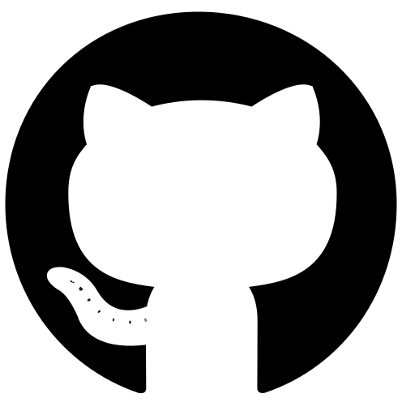

# GitHub Markdown Preview

[](https://neovim.io/)
[](https://github.com/)
[](https://bun.sh/)

Live Preview of your Markdown files & local git repositories.

Powered by [Bunvim](https://github.com/wallpants/bunvim) and [Pantsdown](https://github.com/wallpants/pantsdown).

## ✨ Features

- [💻 Linux / macOS / WSL](./docs/features.md#-linux--macos--wsl)
- [🔴 LIVE updates](./docs/features.md#-live-updates)
- [♻️ Synced Scrolling](./docs/features.md#%EF%B8%8F-synced-scrolling)
- [🌈 Dark & Light modes](./docs/features.md#-dark--light-modes)
- [🖍️ Cursorline in Preview](./docs/features.md#%EF%B8%8F-cursorline-in-preview)
- [🏞️ Local Image Support](./docs/features.md#%EF%B8%8F-local-image-support)
- [🧜 Mermaid Support](./docs/features.md#-mermaid-support)
- [📄 Single-file mode](./docs/features.md#-single-file-mode)
- [📂 Repository mode](./docs/features.md#-repository-mode)

## ▶️ Demo


## ✅ Requirements

- [x] [Bun](https://bun.sh)
- [x] [Neovim](https://neovim.io)

## 📦 Installation

<details>
    <summary>
        Using <a href="https://github.com/folke/lazy.nvim">lazy.nvim</a>
    </summary>

```lua
{
    "wallpants/github-preview.nvim",
    -- version = "*", -- latest stable version, may have breaking changes if major version changed
    -- version = "^1.0.0", -- pin major version, include fixes and features that do not have breaking changes
    cmd = { "GithubPreviewStart", "GithubPreviewToggle" },
    opts = {
        -- config goes here
    }
}
```

</details>

<details>
    <summary>
        Using <a href="https://github.com/wbthomason/packer.nvim">packer.nvim</a>
    </summary>

```lua
use {
    "wallpants/github-preview.nvim",
    disable = false,
    opt = true,
    cmd = { "GithubPreviewStart", "GithubPreviewToggle" },
    -- tag = "*", -- latest stable version, may have breaking changes if major version changed
    -- tag = "v2.0.0", -- pin specific tag
    config = function()
        require("github-preview").setup({
            -- config goes here
        })
    end,
}
```

</details>

## ⚙️ Setup

`setup` must be called for the plugin to be loaded. Some plugin managers handle this for you.

```lua
require("github-preview").setup({
	-- these are the default values,
	-- any values you specify will be merged with this dictionary

	host = "localhost",

	port = 6041,

	-- set to "true" to force single-file mode & disable repository mode
	single_file = false,

	-- "system" | "light" | "dark"
	theme = "system",

	-- define how to render <details> tags on init/content-change
	-- true: <details> tags are rendered open
	-- false: <details> tags are rendered closed
	details_tags_open = true,

	cursor_line = {
		disable = false,

		-- CSS color
		-- if you provide an invalid value, cursorline will be invisible
		color = "#c86414",
		opacity = 0.2,
	},

	scroll = {
		disable = false,

		-- Between 0 and 100
		-- VERY LOW and VERY HIGH numbers might result in cursorline out of screen
		top_offset_pct = 35,
	},
})
```

## 💻 Usage

🚨 The first time you run `:GithubPreviewStart`, it might take a few seconds for your browser to open as dependencies are being downloaded.
This might happen again after a plugin update if there were any changes to the plugin dependencies.

### `:GithubPreviewStart`

Start service. If an instance of **github-preview.nvim** is already running,
be it by the current Neovim instance or another, the older **github-preview.nvim**
is unalived in favour of the younger one.

### `:GithubPreviewStop`

Stops the service. Closes browser tab as well.

### `:GithubPreviewToggle`

Starts the service if not running or stops it if it's already running.

## 👷 Development & Contributing

[See documentation](/docs/development.md)

## 🚀 Roadmap

1. Update demo gif (2 nov)
2. Figure out how to write nvim help.txt
3. Code line highlights when "#" in url (1 nov)
4. Write development docs (31 oct)
5. add tooltip on disabled relative links in single-file mode indicating they're disabled because of single-file mode
6. Write issue templates (31 oct)
7. Dir navigation in markdown container (30 oct)
8. Update config modal to use headlessui components
9. Better Mermaid support (27 oct)
   - rerun mermaid on explorer expand collapse
   - replace mermaid example in features.md with something more legible
   - center svgs
   - memoize svgs (this might fix the scroll jumping when mermaid diagrams above cursor line & improve performance)
10. write checkhealth (23 oct)
11. setup dependabot (2 nov)
12. fix dark theme flash. when dotfiles theme = light, the app flashes dark before turning light (3 nov)
13. update config validation in init.lua (3 nov)
14. export builtin functions like telescope does and add docs explaining how to use them to setup a user-command or a keymap
