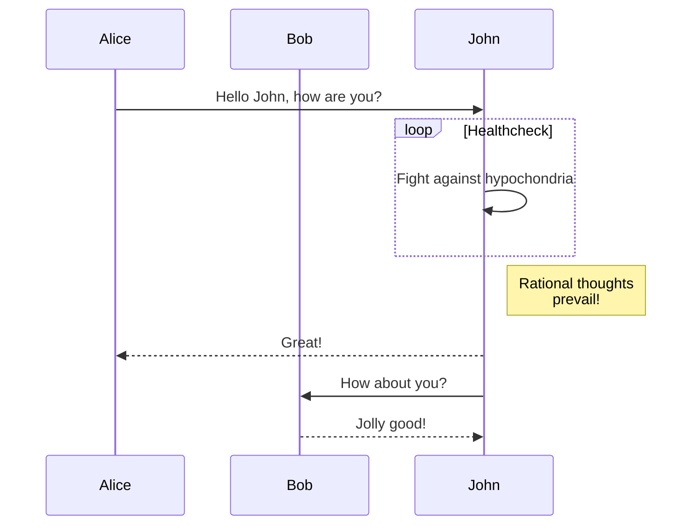

#### [👈 README.md](/README.md)

# ✨ Features

## 💻 Linux / macOS / WSL

Compatible with Linux, macOS and WSL[^1].

[^1]:
    When running **github-preview** in WSL, the system will attempt to open a browser from the
    Linux system. You could either [install a Linux browser](https://learn.microsoft.com/en-us/windows/wsl/tutorials/gui-apps)
    for auto-open to work or you can manually open a browser in your Windows system and enter
    **github-preview**'s url (by default: http://localhost:6041).

## 🔴 LIVE updates

See updates live in your browser as you edit your files.

## ♻️ Synced Scrolling

Live Preview auto scrolls following your cursor in Neovim.

https://github.com/wallpants/github-preview.nvim/assets/47203170/71036418-3517-4f5e-9b6e-6c7004258604

## 🌈 Dark & Light modes

Toggle between light and dark modes.

https://github.com/wallpants/github-preview.nvim/assets/47203170/fe029bad-25a6-4c4a-be3d-16e5a965c004

## 🖍️ Cursorline in Preview

Cursorline position is estimated and may sometimes be a bit off.

https://github.com/wallpants/github-preview.nvim/assets/47203170/d61958a2-f939-4bde-a2ec-4caaf3434f4b

## 📹 Video Support

If a an absolute url (e.g. https://...) is detected, the plugin checks if it's a video source,
and if it is, the video is rendered.

Has only been tested with videos uploaded directly through the GitHub Editor
[as explained here](https://stackoverflow.com/a/4279746), but any URL that responds with a valid
video src `<video src="url">` should be rendered as a video. If your internet connection is slow,
it may take some seconds for the video to render.

https://github.com/wallpants/github-preview.nvim/assets/47203170/a3b03aac-2cd9-4bb9-a68b-3c123c16c651

## 🏞️ Local Image Support

Relative image sources (example: ``) are resolved and rendered if found.

## 📌 Single-file mode

When the plugin starts, it attempts to find a `.git` directory to identify a repository root.
If no repository is found, **_repository mode_** is disabled and plugin starts
in **_single-file mode_**.

You can also force **_single-file mode_** in your [config](/README.md#%EF%B8%8F-configuration),
toggle it through the web UI, or through the [functions this plugin exposes](/README.md#-advanced-usage).

In this mode, the preview is locked to one buffer.

https://github.com/wallpants/github-preview.nvim/assets/47203170/5a3ddbcc-dc4e-4058-910a-61059a9357a5

## 📂 Repository mode

If a git repository is detected, **_repository_** mode is enabled.

You can disable **_repository mode_** in your [config](/README.md#%EF%B8%8F-configuration)
by forcing **_single-file mode_**.

In this mode, the preview will follow your cursor wherever it goes. You can click on
relative links and browse the repository similar to how you would do it on GitHub.

https://github.com/wallpants/github-preview.nvim/assets/47203170/092a4658-6f74-4f7b-831c-1b08689929d2

## 🧜 Mermaid Support

Basic [mermaid](https://github.blog/2022-02-14-include-diagrams-markdown-files-mermaid/) support.

The following block would result in the svg below.

````

````


