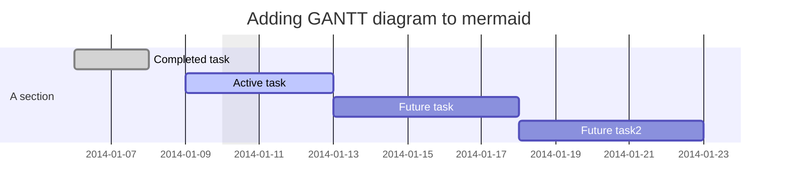

# Features


## Linux / macOS / WSL

Compatible with Linux, macOS and WSL[^1].

[^1]:
    When running **github-preview** in WSL, the system will attempt to open a browser from the
    Linux system. You could either [install a Linux browser](https://learn.microsoft.com/en-us/windows/wsl/tutorials/gui-apps)
    for auto-open to work or you can manually open a browser in your Windows system and enter
    **github-preview**'s url (by default: http://localhost:6041).

## Live Updates

See updates live in your browser as you edit your files.

## Synced Scrolling

Live Preview auto scrolls following your cursor in Neovim. You can customize/disable scrolling
in your [Setup](../README.md#setup).

## Light & Dark modes

TODO: add gif or images

## Cursorline in Preview

Cursorline position is estimated and may sometimes be a bit off. You can customize/disable
the cursorline in your [Setup](../README.md#setup).

## Local Image Support

Relative image sources (example: ``) are resolved and rendered if found.

## Mermaid Support

Basic [mermaid](https://mermaid.js.org/) support.

The following block would result in the svg below.

````

````


## Single-file Mode

Run `:GithubPreviewStart` whilst your current buffer contains a file to preview it live.
If no file has been loaded into the current buffer and your `cwd` is not a GitHub Repository,
you'll get an error.

## Repository Mode

If your `cwd` is a GitHub Repository or within one, **Repository Mode** will be enabled.
You can even run `:GithubPreviewStart` without loading a file into the Neovim buffer if
in a repo.
