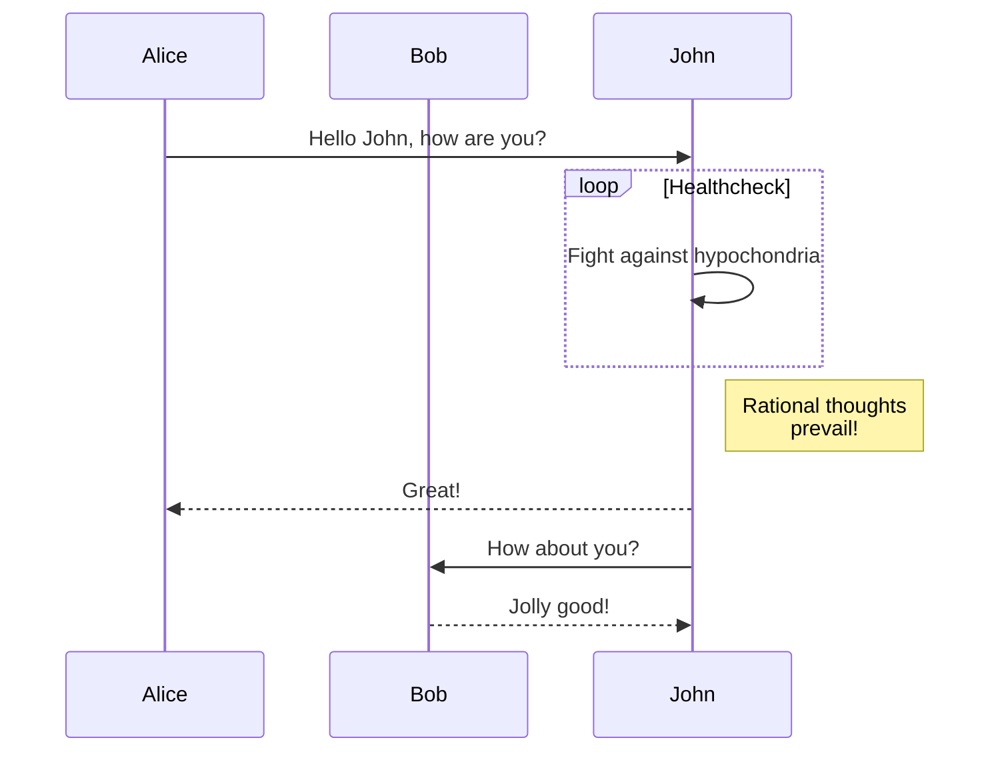

# ✨ Features

## 💻 Linux / macOS / WSL

Compatible with Linux, macOS and WSL[^1].

[^1]:
    When running **github-preview** in WSL, the system will attempt to open a browser from the
    Linux system. You could either [install a Linux browser](https://learn.microsoft.com/en-us/windows/wsl/tutorials/gui-apps)
    for auto-open to work or you can manually open a browser in your Windows system and enter
    **github-preview**'s url (by default: http://localhost:6041).

## 🔴 LIVE updates

See updates live in your browser as you edit your files.

## ♻️ Synced Scrolling

Live Preview auto scrolls following your cursor in Neovim. You can customize/disable scrolling
in your [config](../README.md#%EF%B8%8F-configuration).


## 🌈 Dark & Light modes

Toggle between light and dark modes.

## 🖍️ Cursorline in Preview

Cursorline position is estimated and may sometimes be a bit off. You can customize/disable
the cursorline in your [config](../README.md#%EF%B8%8F-configuration).


## 🏞️ Local Image Support

Relative image sources (example: ``) are resolved and rendered if found.

## 📄 Single-file mode

When the plugin starts, it attempts to find a `.git` directory to identify a repository root.
If the plugin can't find a git repository, **_single-file_** mode is enabled.

You can also force **_single-file_** mode in your [config](../README.md#%EF%B8%8F-configuration).

In this mode, the preview is locked to one file.

## 📂 Repository mode

If a git repository is detected, **_repository_** mode is enabled.

You can disable **_repository_** mode in your [config](../README.md#%EF%B8%8F-configuration).

In this mode, the preview will follow your cursor wherever it goes. You can click on
relative links and browse the repository similar to how you would do it on GitHub.

## 🧜 Mermaid Support

Basic [mermaid](https://github.blog/2022-02-14-include-diagrams-markdown-files-mermaid/) support.

The following block would result in the svg below.

````

````


